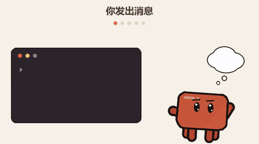
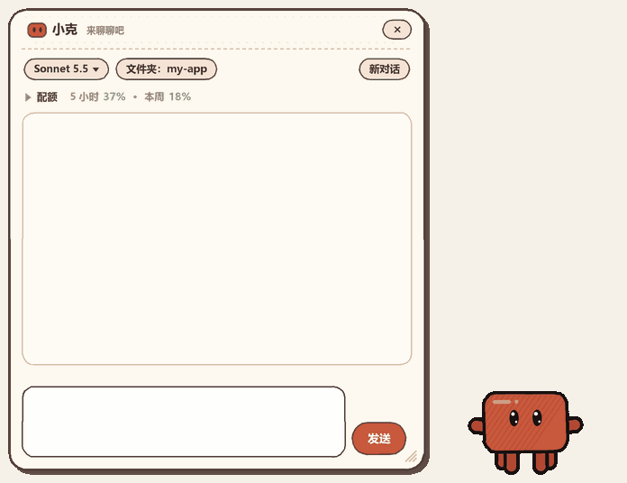

# Claude 小克（claude-pet）

[English](README.md) | [繁體中文](README.zh-TW.md) | **简体中文**

一只住在 Windows 桌面上的手绘风小宠物，会跟着 [Claude Code](https://claude.com/claude-code) 的工作状态做出不同的动作：
你发送消息时它在思考，Claude 开始敲命令时它跟着敲键盘，做完了它会开心地跳起来。还能直接跟它聊天、选模型和思考强度、查看配额。



> 这是个人兴趣项目，与 Anthropic 无关。角色造型是参考社区里常见的“小克”卡通形象所画的同人作品。

## 能做什么

**右键菜单**：聊天、配额、换模型、调思考强度、小动作、设置。带子菜单的项目，光标停上去就会在旁边展开，和 Windows 的菜单一样。


**直接跟小克对话**：像在一个小窗口里用 Claude Code。可以选模型、思考强度和工作文件夹，可以查看 5 小时和每周的配额（默认收成一行，点一下展开），需要批准的工具也直接在窗口里点。小克会跟着发生的事做出反应。



## 安装

需要：Windows 10／11、Python 3.9 及以上（需要包含 `tkinter`，python.org 的安装程序默认就带）、已安装并登录的 Claude Code。

```powershell
pip install git+https://github.com/wkai2573/claude-pet
claude-pet install
```

`claude-pet install` 会做三件事：

1. 把 hooks 配置进 Claude Code 的 `~/.claude/settings.json`。**会先备份**，而且只添加属于 claude-pet 的那几条，你原有的其他设置和 hooks 都原封不动；重复运行不会重复添加。
2. 在桌面创建“Claude Pet”快捷方式。
3. 启动小克。

装好后，**新开一个 Claude Code 对话**（或重启当前对话），hooks 才会生效。

> - 用 pipx 或 uv 安装也可以：`pipx install git+https://github.com/wkai2573/claude-pet` 或 `uv tool install git+https://github.com/wkai2573/claude-pet`。
> - 如果提示找不到 `claude-pet` 命令（pip 把命令放在 Python 的 `Scripts` 文件夹里，不一定在 PATH 中），改用 `python -m claude_pet install` 即可。
> - 不想要桌面快捷方式：`claude-pet install --no-shortcut`。想先看看它会写入什么、但不真正修改：`claude-pet install --dry-run`。

### 日常使用

| 命令 | 说明 |
|---|---|
| `claude-pet` | 启动小克（在后台运行，立刻回到命令行）。Claude Code 开始工作时，hooks 也会自动把它叫出来 |
| `claude-pet stop` | 请小克退出（也可以右键选择 “Close”（关闭）） |
| `claude-pet doctor` | 检查环境，报告哪里有问题（Python、tkinter、Pillow、`claude` 命令、hooks 是否装好） |
| `claude-pet update` | 检查有没有新版本、显示更新内容并更新（`--check` 只看不装，`-y` 不再询问） |
| `claude-pet run` | 在前台运行；没有反应时用它查看错误信息 |

同一时间只会有一只：再次启动会直接退出。

### 卸载

```powershell
claude-pet uninstall            # 移除 hooks 和快捷方式、关闭正在运行的小克（保留你的设置）
claude-pet uninstall --purge    # 连设置和缓存一起删除
pip uninstall claude-pet
```

`uninstall` 只会移除 `install` 添加的 hooks，其他设置不动，同样会先备份。

### 更新

小克每天会在后台检查一次 GitHub（没有网络就悄悄跳过）。有新版本时：

- 小克会冒出一个气泡，右键菜单最上面多出一项 “**Update to vX.Y.Z**”（更新到 vX.Y.Z）；
- 点进去会先显示**更新内容**（Release 的说明），再让你选 “**Update now**”（立即更新）、“**Later**”（以后再说）或 “**Skip this version**”（跳过这个版本）；
- “Update now” 会帮你做完剩下的事：小克先关闭、pip 升级 claude-pet、同步 hooks、小克再回来（会用气泡告诉你成功了；如果中途出错，会回到原来的版本，详细记录在 `%APPDATA%\claude-pet\update.log`）。

习惯用命令行？`claude-pet update` 会先显示更新内容、询问后再安装；`claude-pet update --check` 只看不装。
不想被提醒？在设置窗口里把 “**Updates**”（更新）关掉（仍然可以按 “Check now”（立即检查））。
更新不需要安装 git。从源码文件夹运行（`pip install -e .`）时不会自己更新，只会提醒你执行 `git pull`。
### 设置文件和数据放在哪里

用户数据放在 `%APPDATA%\claude-pet\`（`config.json`、`state.json`、`quota.json`、`icon.ico`），不放在程序旁边，所以升级或重装不会丢失设置。
备份文件在 `~\.claude\` 下，文件名形如 `settings.json.claude-pet-20261002-143045.bak`。

## 它长什么样、会做什么

圆角方块身体、深色粗轮廓、斜线纹理，两只短手、四条短腿（每侧外侧的后腿比前腿短一点）。

| 状态 | 动作 |
|---|---|
| 平常 | 呼吸、眨眼、左右张望，偶尔挥手 |
| Claude 在思考 | 歪头，头上冒出思考云 |
| Claude 在执行命令、改文件 | 皱眉认真，双手在键盘上敲 |
| Claude 在读文件、搜索 | 举着放大镜 |
| 这一轮做完 | 弹跳（有弹性的压扁与拉长），眼睛变成 `^ ^`，有时戴墨镜 |
| 工具失败 | 眩晕：螺旋眼、身体摇晃、头上绕着星星 |
| 需要你回复或批准 | 跳着挥舞双手，头上冒出感叹号 |
| 闲置两分钟 | 瘫坐着睡着，冒出 zZz |
| 你用鼠标点它 | 被捏扁、冒出爱心 |
| 快速双击 | 气泡显示 Claude 配额（5 小时、每周） |

另外：

- **对话气泡**：状态改变时冒出一个小而淡的半透明气泡（“做好了！”“换你了～”）。
- **右键菜单**：自己绘制的小卡片，分成 “Chat”（对话）和 “Pet”（小克）两个分类（下面先写英文界面的名称，括号里是简体中文界面显示的名称）：
  - 对话：Chat with Claude（跟小克聊天）、Usage（配额）、**Model ▸**（模型）、**Effort ▸**（思考强度），右侧淡淡地显示当前的选择
  - 小克：**Actions ▸**（动作：摸摸、睡觉或叫醒、开心跳、思考、敲键盘、放大镜、眩晕、招手）、**Settings…**（设置，打开设置窗口）
  - 最后是 “Close”（关闭）
  - 带 ▸ 的行，光标停上去就会像 Windows 菜单一样在右侧弹出子菜单（靠近屏幕右边缘时改在左侧）。
- **设置窗口**：语言（English／繁體中文／简体中文，默认英文）、大小、自动出现、更新提醒、重置位置。
- **可拖动**：拖到屏幕上任何位置（包括副屏），位置会被记住。

## 和小克聊天、选模型、查看配额

右键选择 “Chat with Claude”，会打开一个手绘风的聊天窗口（没有系统标题栏：拖动顶部的标题栏来移动，拖动右下角来调整大小，右上角的 × 只是把窗口收起来；窗口会一直在最上层），用法就像在终端里用 Claude Code：
后端直接调用你已安装、已登录的 `claude` 命令（`claude -p` 的 stream-json 模式），
所以登录状态、`CLAUDE.md`、项目设置和可用工具都和平时一样，小克不接触任何密钥。

- **回复**：边生成边显示；`` ```代码块``` ``、`行内代码`、**粗体** 会排版。
- **工具权限**：Claude 要使用工具（改文件、执行命令）时，窗口上方会弹出黄色卡片，
  可选 “Allow”（允许）、“Always allow”（本次都允许，仅限这个工具、在这次对话里）或 “Deny”（拒绝）；小克头上会冒出感叹号提醒你。只读操作 CLI 本来就会自动放行，不会询问。
- **停止**：回复过程中，发送按钮会变成 “Stop”（停止），按下就会中断，对话可以接着聊。
- **模型**：窗口左上角的模型按钮（或右键菜单里的 “Model ▸”）。
  对话中途切换也可以，之后的回复就使用新模型。“Default”（默认）依 Claude Code 的设置文件而定。
  可选的有 Fable 5.1、Opus 5.5、Sonnet 5.5、Haiku 4.5；你的账号用不了的模型（例如需要额外充值的）会直接显示 CLI 返回的错误信息。
- **思考强度（Effort）**：Claude 想得多深（Low、Medium、High、Extra high、Max）。模型按钮上也会显示（例如 `Sonnet 5.5 · High`），点开有 “模型 ▸” “思考强度 ▸”，右键菜单里也有 “Effort ▸”。Low 到 Extra high 在对话中途切换立刻生效；“Max” 要从下一次新对话才生效。“默认” 依 Claude Code 的设置文件决定。不支持思考强度的模型会直接忽略它。
- **工作文件夹**：窗口上的文件夹按钮可以更换，默认是你的用户文件夹；更换后会开始新对话。“New chat”（新对话）会清空当前内容。
- **配额**：按钮下面有一行摘要（`▸ 配额  5 小时 37% · 本周 18%`），点一下展开成两条进度条（附重置时间），再点收回去。默认收合，会记住你的选择。每轮回复结束后自动更新，点进度条可以立刻重新查询。
  快速双击小克，或在菜单里选 “Usage”，会用气泡报告一次；数据超过 2 分钟就先查询一次，
  查询用的是极简的一次调用（约 800 tokens），几乎不耗额度。结果缓存在 `quota.json`。
- 窗口下方的状态栏会显示 “Thinking…”（思考中）、“Using PowerShell…”（使用 PowerShell）、“Waiting for approval…”（等你批准）。
- 关闭窗口只是收起来，对话还在；退出小克时，对话进程会一并结束。
- 聊天期间，小克的动作由聊天本身直接驱动（思考、敲键盘、放大镜、等你批准、做完开心跳），
  这些对话进程不会再触发 hook（它们带有 `CLAUDE_PET_CHILD` 环境变量），避免重复。

## 设置（`config.json`）

位于 `%APPDATA%\claude-pet\config.json`，由宠物自动维护，也可以手动编辑（先退出宠物再改）：

| 字段 | 说明 | 默认值 |
|---|---|---|
| `scale` | 大小：`0.6` 小、`0.8` 中、`1.0` 大、`1.3` 特大（在设置窗口里改） | `0.8` |
| `lang` | 界面语言：`en` 英文、`zh` 繁体中文、`zh-CN` 简体中文（在设置窗口里改） | `en` |
| `update_check` | 每天检查一次 GitHub 有没有新版本并提醒你（在设置窗口里改） | `true` |
| `x`、`y` | 窗口位置（拖动后自动记录） | 主屏幕右下角 |
| `disabled` | 为 `true` 时，hook 不会在宠物没开时自动把它叫出来（已经开着的仍会跟着动） | `false` |
| `chat_model` | 聊天使用的模型 ID；`null` 表示依 Claude Code 的设置 | `null` |
| `chat_effort` | 聊天使用的思考强度（`low`、`medium`、`high`、`xhigh`、`max`）；`null` 表示依 Claude Code 的设置 | `null` |
| `chat_quota_open` | 聊天窗口的配额进度条是否展开 | `false` |
| `chat_cwd` | 聊天的工作文件夹（可在窗口里更换） | 用户文件夹 |
| `chat_x`、`chat_y`、`chat_size` | 聊天窗口的位置和大小（拖动、拉伸后自动记录） | 小克旁边、460×660 |
| `claude_path` | 自动找不到 `claude` 命令时，手动指定它的完整路径 | 自动查找 |

## 手动配置 hooks（不想用 `claude-pet install` 时）

宠物靠 Claude Code 的 hooks 获取状态。`python -m claude_pet.hook` 会在每个事件发生时被调用，把状态写进 `state.json`，宠物每 0.2 秒读取一次；
宠物没在运行时，它也会顺便把宠物叫出来。它不输出任何内容、始终以 0 退出，出错也不会影响 Claude Code。

在 `~/.claude/settings.json` 的 `hooks` 部分，下面这些事件都执行同一条命令：

| Claude Code 事件 | 是否需要 `matcher` | 宠物的状态 |
|---|---|---|
| `UserPromptSubmit`、`PostToolUse` | `PostToolUse` 需要（`"*"`） | 思考 |
| `PreToolUse`（读文件、搜索类工具） | 需要（`"*"`） | 拿放大镜 |
| `PreToolUse`（其他工具） | 需要（`"*"`） | 敲键盘 |
| `PostToolUseFailure` | 需要（`"*"`） | 眩晕 2 秒后回到思考 |
| `Notification` | 不需要 | 挥手提醒你注意 |
| `Stop` | 不需要 | 开心跳跃 4 秒后回到平常 |
| `SessionStart` | 不需要 | 打招呼 |

命令形如：（换成你自己的 `python.exe` 完整路径，必须是装了 claude-pet 的那个 Python）

```json
{ "type": "command", "command": "C:/path/to/python.exe -m claude_pet.hook" }
```

**路径不要加引号。** Claude Code 在 Windows 上执行 hook 所用的 shell 并不固定（有的环境是 bash，有的是 PowerShell），
“带引号的路径后面再跟参数”在 PowerShell 里会出现语法错误，不加引号两边都能运行。路径含空格时，用 `dir /x` 查出 8.3 短路径来使用。
`claude-pet install` 已经替你处理好这件事了。

## 故障排除

先运行 `claude-pet doctor`，它会逐项检查并告诉你哪里有问题。

- **宠物没有出现**：运行 `claude-pet run`（前台运行，会打印错误信息）。
- **hooks 没有生效**：确认 `claude-pet doctor` 显示 hooks 已配置，并且是在 `install` 之后新开的 Claude Code 对话。
- **跑到别的屏幕或不见了**：右键选择 “Settings…” → “Reset position”（重置位置），或删除 `config.json` 里的 `x`、`y`。
- **不想让它自动弹出来**：在设置窗口里把 “Auto-appear”（自动出现）关掉，或把 `config.json` 里的 `disabled` 设为 `true`。
- **聊天没反应，或提示找不到 claude 命令**：先在终端里确认 `claude --version` 能运行，必要时在 `config.json` 里设置 `claude_path`。
- **想完全关掉**：右键选择 “Close”，或运行 `claude-pet stop`。

## 开发

```powershell
git clone https://github.com/wkai2573/claude-pet
cd claude-pet
pip install -e .          # 可编辑安装：改代码立即生效
claude-pet doctor
python -m claude_pet run  # 前台运行
```

没有构建步骤。三个预览命令不会打开窗口，调整界面时很方便：

```powershell
claude-pet dev sheet sheet.png        # 把所有动作的帧排成一张图
claude-pet dev ui-sheet ui.png        # 对话气泡和右键菜单（深色与浅色背景）
claude-pet dev icon icon.ico          # 重新生成快捷方式用的图标
```

仓库根目录的 `hook.py` 只是兼容旧版配置的转接文件（旧版 README 教大家在 settings.json 里直接调用它）；`claude-pet install` 会把旧的配置换成新的。

### 发布新版本

1. 修改 `claude_pet/__init__.py` 里的 `__version__`（唯一需要改的地方，`pyproject.toml` 会读取它）并提交。
2. 打标签并推送：`git tag v0.2.0 && git push origin v0.2.0`。
3. 到 GitHub 为该标签创建一个 **Release** 并写好说明。**用户更新前看到的，就是这段文字。** 草稿和预发布版会被忽略。
### 文件

| 文件 | 用途 |
|---|---|
| `claude_pet/pet.py` | 宠物本体：绘图、动作、对话气泡、右键菜单、窗口 |
| `claude_pet/chat.py` | 聊天功能：`claude` 子进程（Session）、配额、聊天窗口、与小克的衔接 |
| `claude_pet/settings.py` | 设置窗口：语言、大小、自动出现、重置位置 |
| `claude_pet/widgets.py` | 手绘风公共组件：按钮、滚动条、窗口底图、配色（聊天窗口和设置窗口共用） |
| `claude_pet/i18n.py`、`cli_text.py` | 界面文字（英文／繁体中文／简体中文）；要增加语言，就在这里加一份字符串表 |
| `claude_pet/screens.py` | 多屏幕支持：查询某个坐标所在屏幕的工作区 |
| `claude_pet/hook.py` | 供 Claude Code hooks 调用：写入状态、必要时启动宠物（只用标准库，必须保持轻量） |
| `claude_pet/installer.py` | `install`／`uninstall`／`doctor` |
| `claude_pet/update.py` | 更新：检查 GitHub Releases、比较版本、一键更新（不涉及 Tk） |
| `claude_pet/update_window.py` | 更新提醒（调度、气泡、菜单项）与更新内容窗口 |
| `claude_pet/cli.py` | 命令行入口（`claude-pet`） |
| `claude_pet/paths.py` | 文件位置（文件夹、端口）；环境变量 `CLAUDE_PET_HOME`、`CLAUDE_PET_PORT`、`CLAUDE_CONFIG_DIR` 可以覆盖，测试用 |

### 工作原理

- 角色用 Pillow 以 3 倍超采样绘制成矢量风格，再缩小；每个形状先画一圈放大的深色轮廓再填色，轮廓会轻微抖动，营造出手绘动画的感觉。
- 窗口是 Tkinter 的无边框窗口，用 `-transparentcolor` 抠掉背景。这种透明只能整个像素要么全透明、要么不透明，所以半透明的对话气泡和菜单各自是独立窗口，再用 `-alpha` 设置整体透明度。
- 性能：动作只由时间 `t` 决定，所以每种动作有一个循环长度（`LOOP`），帧由后台线程预先画好并缓存（上限约 40 MB），
  UI 线程每帧只负责贴图；菜单的卡片底和文字各画一次就缓存，光标移动只补一块色块；
  聊天窗口拉伸时用低分辨率底图，松开后再补画。闲置 CPU 约 3–4%（原来约 34%）。
- 多屏幕：位置一律按 Windows 的屏幕工作区（扣除任务栏）计算（`screens.py`），而不是只看主屏幕。
  小克会记住你把它放在哪个屏幕；菜单、弹出的子菜单、设置窗口都留在小克／光标所在的屏幕，
  靠近屏幕边缘时会向内收或翻到另一侧；聊天窗口在小克换了屏幕后再次打开，会跟到小克旁边。
- 单一实例：宠物启动时绑定本机的 `47651` 端口当作锁，hook 通过连接这个端口判断宠物是否在运行，`claude-pet stop` 也是连上去发送一个 `quit`。
- 状态过期保护：思考、工作、等待回复的状态超过一段时间没有新事件，会自动回到平常，避免因为中断而卡住。

## 许可证

[MIT](LICENSE)
